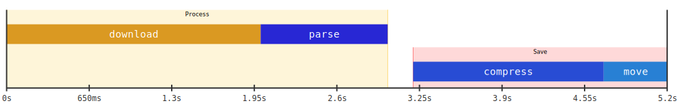

# svg-timeline

Small go library and CLI tool to generate timeline SVGs based on the duration of events.



## Usage

### As a library

Check the reference [documentation](https://pkg.go.dev/github.com/aorith/svg-timeline)

```go
package main

import (
	"fmt"
	"time"

	svgtimeline "github.com/aorith/svg-timeline"
)

func main() {
	tl := svgtimeline.NewTimeline()
	tl.AddRow(20, 0)
	tl.GetLastRow().AddEvent(svgtimeline.Event{Type: svgtimeline.EventTypeEra, Text: "Process", Duration: 2 * time.Second})
	tl.AddRow(30, 5)
	tl.GetLastRow().AddEvent(svgtimeline.Event{Type: svgtimeline.EventTypeTask, Text: "create", Duration: 1500 * time.Millisecond})
	tl.GetLastRow().AddEvent(svgtimeline.Event{Type: svgtimeline.EventTypeTask, Text: "save", Duration: 500 * time.Millisecond})
	svg, err := tl.Generate()
	if err != nil {
		panic(err)
	}
	fmt.Println(svg)
}
```

This will print a basic SVG that you can save and open in the browser.

### Using the CLI

Check the command at [cmd/cli](cmd/cli).

See [cmd/cli/examples](cmd/cli/examples) for config examples.

```sh
# Install the CLI tool or run it from cmd/cli
go install github.com/aorith/svg-timeline/cmd/cli@latest

# Generate a timeline from a config file
$ svgtimeline -i complete.cfg -s style.css -o /tmp/timeline.svg
```
